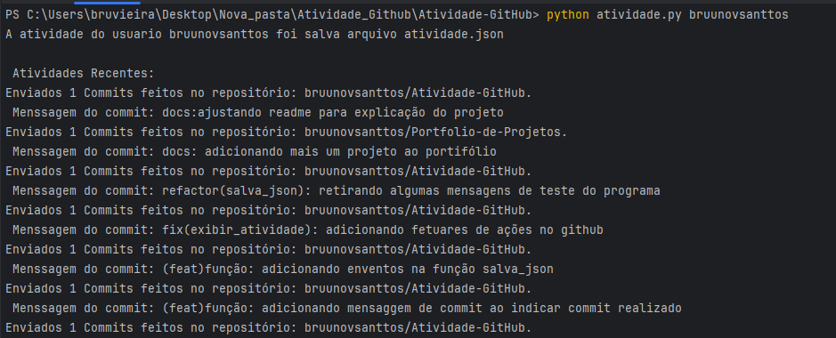
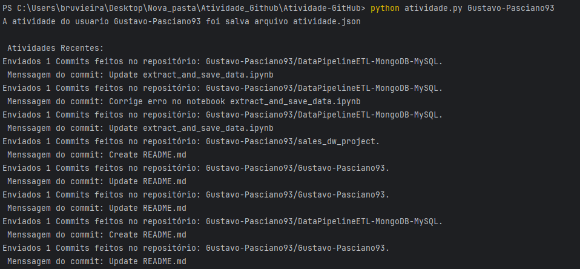
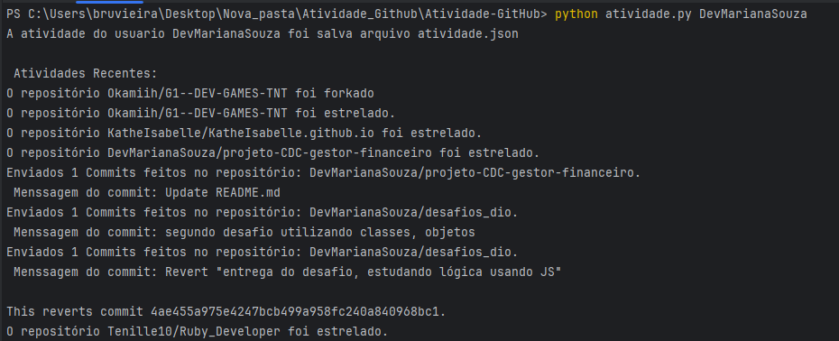

# Atividade-GitHub
Neste projeto foi uilizada a [API do Github](https://docs.github.com/en/rest/activity/events?apiVersion=2022-11-28) com base no projeto criado no [Roadmap.sh](https://roadmap.sh/projects/github-user-activity) para verificar as atividades de usuários da rede Github.  

# Requisitos de Projeto
* Busca e exibe eventos recentes de um usuário no GitHub. 📥
* Salva as atividades em um arquivo JSON para consulta offline. 💾
* Lida com erros de maneira elegante (usuários inválidos, falhas de conexão, etc.).✅
* Suporte a múltiplos tipos de eventos 🛠️, como:
  * Pushes (commits enviados).
  * Issues abertas ou comentadas.
  * Estrelas adicionadas a repositórios.
  * Mensagens de Commit enviadas  

# Ferramentas do Projeto 🔨🔧  
### Linguagem de programação
#### Python 3.12  🐍
### Bibliotecas Utilizadas📚
[Argparse](https://docs.python.org/pt-br/3/library/argparse.html#module-argparse) A utilização dessa biblioteca consiste na manipulação correta dos argumentos dados pelo usuário do programa, sem que ocorram erros.  

[JSON](https://docs.python.org/pt-br/3/library/json.html) Utilizada para a manipulação do arquivo que serve de base para as adições e atualizações de despesas.

[OS](https://docs.python.org/pt-br/3/library/os.html#module-os) Para manipulação de caminhos do programa e controle dos arquivos.

[Requests](https://docs.python.org/pt-br/3/library/http.client.html): Para fazer as requisições HTTP para a API do GitHub e obter os dados de atividade   

### Estrutura do Projeto 

        ``` bash    atividade-github/
    │
    ├── atividade_github.py    # Arquivo principal do projeto; contém a lógica do CLI e as funções para buscar e exibir atividades.
    ├── atividade.json         # Arquivo gerado automaticamente para salvar as atividades do usuário em formato JSON.
    ├── README.md              # Documentação do projeto com detalhes sobre o funcionamento e execução.

#### Descrição dos Arquivos
* atividade_github.py: O script principal que contém todo o código do projeto. É executado via linha de comando para buscar as atividades de um usuário do GitHub.
* atividade.json: Arquivo gerado automaticamente pelo programa, onde os dados das atividades do usuário são armazenados para consulta offline.
* README.md: Arquivo de documentação, explicando o propósito do projeto, como ele funciona, e instruções de uso.


### Como Executar o projeto

1. Clone o Repositório:
    ``` bash
          https://github.com/bruunovsanttos/Atividade-GitHub 
   
2. Instale as dependências: Este projeto depende apenas das bibliotecas padrão do Python (não há dependências externas além do requests, que pode ser instalado via pip):
      ``` bash
          pip install requests
3. Execute o projeto no terminal: O programa pode ser executado a partir da linha de comando, fornecendo o nome de usuário do GitHub como argumento. Exemplo:

    ```bash
        python atividade.py <nome_do_usuario>
   

  * Onde <nome_do_usuario> é o nome do usuário do GitHub cujo histórico de atividade você deseja consultar.  

### Exemplo de saída

Após a execução, você verá uma lista com os eventos recentes do usuário, como:
1.  Usuario: bruunovsanttos  
    
2. Usuario: Gustavo-Pasciano93  
  
3. Usurio: DevMarianaSouza
 


